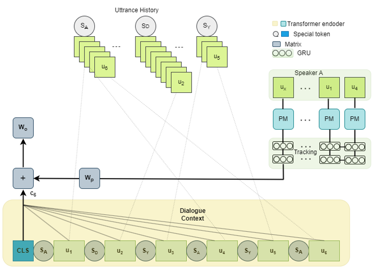

# EmoNet: A Transformer based network for Conversational Emotion Recognition

The overall flow of our model

## Requirements
1. Pytorch 1.8
2. Python 3.6
3. [Transformer 4.4.0](https://github.com/huggingface/transformers)
4. sklearn

## Datasets
Data is split into train/dev/test in the [dataset folder](https://github.com/rungjoo/CoMPM/tree/master/dataset)
1. [EmoryNLP](https://github.com/emorynlp/emotion-detection)

## Train

In this code, the batch size = 1. We do not add padding when the batch is greater than 1.

Argument
- pretrained: type of model (default: roberta-large)
- initial: initial weights of the model (pretrained or scratch) (default: pretrained)
- cls: label class (emotion or sentiment) (default: emotion)
- sample: ratio of the number of the train dataset (default: 1.0)
- freeze: Whether to learn the PM or not

```bash
python3 train.py --initial {pretrained or scratch} --cls {emotion or sentiment} --dataset {dataset} {--freeze}
```

## Testing with pretrained CoMPM
- Unpack model.tar.gz and replace it in {dataset}_models/roberta-large/pretrained/no_freeze/{class}/{sampling}/model.bin
    - class: "emotion" or "sentiment"
    - sampling: 0.0 ~ 1.0, default: 1.0
    
```bash
python3 test.py
```
Test result for one seed. In the paper, the performance of CoMPM was reported as an average of three seeds.

| Model | Dataset (emotion) | Performace: one seed (paper) |
| :------: | :-------: | :-------: | 
| EmoNet | EmoryNLP | 39.18 |

